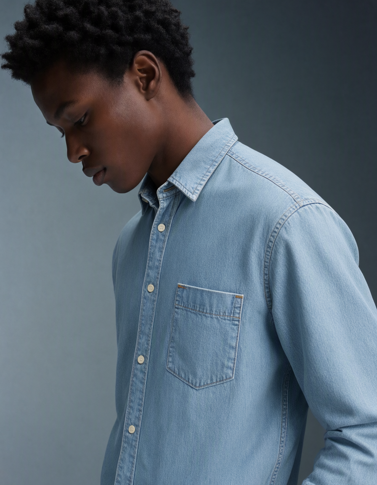

# Qwen-Image-2.1 reference editing

Native MLX inference for [Qwen/Qwen-Image-2.1](https://huggingface.co/Qwen/Qwen-Image-2.1): text-to-image, editing with up to ten reference images, and RGBA output. This is a separate architecture from the earlier [Qwen Image models](../../qwen/README.md), with a 7B diffusion transformer, a Qwen3-VL text/vision encoder, and a 64-channel RGBA VAE.

The new `mflux-generate-qwen-2.1-edit` entry point complements the existing `mflux-generate-qwen-2.1` text-to-image and strength-based img2img command. Both use the same model registry entry. This variant adds the vision tower and interleaved reference conditioning; its components live in `qwen21/reference` because the original text-only port uses a different checkpoint layout and drops alpha. Existing generation behavior and saved checkpoints keep their original entry point.

The editing pipeline includes prefix KV caching, quantization, local checkpoint export/reload, metadata replay, and the common generation callbacks. Training and LoRA loading are not implemented for this model.

## Generate an image

```sh
mflux-generate-qwen-2.1-edit \
  --prompt "A red panda reading a book under a cherry tree, watercolor illustration" \
  --seed 42 \
  --quantize 8 \
  --output qwen21.png
```

Defaults are **40 steps**, **guidance 1.0**, **1024×1024** for text-to-image, and **KV caching enabled**. The aliases `qwen-image-2.1`, `qwen-2.1`, and `qwen-image-21` all select this model; `--model` can be omitted for this command.

The original checkpoint downloads about 33.1 GB of weights, even when quantizing at load time. Quantization applies to eligible transformer and text/vision encoder layers; the VAE stays in fp32. Peak memory depends on resolution, reference images, and quantization. Use `--vae-tiling` to reduce decode memory or `--low-ram` for the common memory-saving callbacks.

Explicit width and height must be multiples of 32. The upstream model-card examples use 2048×2048; request that size explicitly:

```sh
mflux-generate-qwen-2.1-edit \
  --prompt "A detailed illustrated botanical poster with the title SPRING" \
  --width 2048 --height 2048 \
  --seed 42 --quantize 8 \
  --vae-tiling \
  --output poster.png
```

## Edit with reference images



The 896×1152 example uses the two inputs and prompt from the [official ComfyUI editing workflow](https://github.com/Comfy-Org/workflow_templates/blob/main/templates/image_qwen_image_2_1_image_edit.json), an 8-bit model, 25 steps, and guidance 1. The person retains the pose and background while wearing the second reference's denim shirt.

```sh
mflux-generate-qwen-2.1-edit \
  --image-paths portrait.png \
  --prompt "Change the jacket to dark green. Preserve the person's face and pose." \
  --seed 42 --quantize 8 \
  --output-resolution 512 \
  --output edited.png
```

```sh
mflux-generate-qwen-2.1-edit \
  --image-paths subject.png scene.png \
  --prompt "Place the subject from image 1 in the setting of image 2." \
  --seed 42 --quantize 8 \
  --output-resolution 512 \
  --output combined.png
```

The editing examples use the 512-pixel reference budget exercised by the local single- and two-reference visual checks. See [validation results](VALIDATION.md) for the larger-size samples and their limitations.

Reference order is significant. If width and height are omitted, the last reference image determines the output aspect ratio. `--output-resolution` defaults to 1024 and sets the pixel-area budget used to resize each reference and derive automatic output dimensions. `--width` and `--height` control output dimensions independently of that reference budget. Reference images must remain within the checkpoint processor's pixel-area range after resizing; the default budget handles ordinary aspect ratios.

RGBA references retain alpha in the VAE. The vision encoder reads a separate copy composited over white, matching the upstream pipeline.

## Transparent output

```sh
mflux-generate-qwen-2.1-edit \
  --prompt "This is an RGBA image with transparency. A cute red panda sticker. The image has alpha channel and the background is transparent." \
  --seed 42 --quantize 8 \
  --output sticker.png
```

All outputs have four channels; the prompt determines whether the generated alpha is transparent or opaque. The CLI accepts PNG, WebP, and TIFF to retain alpha. PNG is recommended for lossless output and embedded metadata.

## Quantized checkpoints and reproducibility

Export the complete reference-capable model from Python:

```python
from mflux.models.qwen21.reference import QwenImage21Edit

model = QwenImage21Edit(quantize=8)
model.save_model("./qwen21-8bit")
```

The existing `mflux-save --model qwen-image-2.1` exports the original text-only implementation and omits the vision tower. Those exports cannot be used by this editing entry point. Use the native Hugging Face checkpoint or an export produced by `QwenImage21Edit.save_model`.

```sh
mflux-generate-qwen-2.1-edit \
  --model ./qwen21-8bit \
  --prompt "A red panda reading a book" \
  --seed 42 --metadata \
  --output saved-model.png

mflux-generate-qwen-2.1-edit \
  --model ./qwen21-8bit \
  --config-from-metadata saved-model.metadata.json \
  --output replay.png
```

Use `--no-use-kv-cache` to recompute the prefix each step. Keep this setting fixed when comparing samples: cached and uncached execution can produce different images in reduced precision. Metadata records the cache flag and reference resolution budget, and explicit CLI values override restored metadata. MLX and PyTorch use different random-number generators, so matching seeds alone does not imply matching images.

Optional classifier-free guidance uses `--guidance` greater than 1 and `--negative-prompt`. The trained default is 1.0. See the [common CLI documentation](../../common/README.md) for prompt files, seeds, step previews, and other shared flags.

## Python

```python
from mflux.models.qwen21.reference import QwenImage21Edit

model = QwenImage21Edit(quantize=8)
image = model.generate_image(
    seed=42,
    prompt="A red panda reading a book, transparent background",
    width=1024,
    height=1024,
)
image.save("panda.png")

edited = model.generate_image(
    seed=42,
    prompt="Give the panda a blue scarf.",
    image_paths=["panda.png"],
    output_resolution=512,
)
edited.save("panda-scarf.png")
```

## Reference and validation

The port targets checkpoint revision [`b3179ad`](https://huggingface.co/Qwen/Qwen-Image-2.1/tree/b3179ad355be050328e483a9dfdd9e60cd62adfa) and the Diffusers implementation at [`80c7ed2`](https://github.com/huggingface/diffusers/tree/80c7ed262aeffbeb43ef13ae04baeb9b84515a69/src/diffusers/pipelines/qwenimage21). Adapted model code retains its Apache-2.0 attribution; the upstream license is included in [LICENSE.diffusers](LICENSE.diffusers). Checkpoint use is governed by the model's [Qwen Research License](https://huggingface.co/Qwen/Qwen-Image-2.1/blob/b3179ad355be050328e483a9dfdd9e60cd62adfa/LICENSE).

Fast tests cover the registry, metadata, RGBA serialization, latent layout, prefix masks, and cached decoding. Optional reference tests compare transformer, VAE, and scheduler behavior against Diffusers with identical weights and inputs. The small PyTorch reference models run on CPU so the tests do not depend on the CI runner's MPS support; MLX still uses Metal. Diffusers comparisons skip when that reference implementation is unavailable:

```sh
MFLUX_PRESERVE_TEST_OUTPUT=1 uv run \
  --with "diffusers @ git+https://github.com/huggingface/diffusers@80c7ed262aeffbeb43ef13ae04baeb9b84515a69" \
  python -m pytest tests/image_generation/test_qwen_image21_parity.py
```

Real checkpoint tests have produced 1024-pixel text-to-image and transparent PNG outputs, 512-pixel single- and two-reference edits, a successful 896×1152 two-reference clothing edit using the official ComfyUI workflow inputs, and pixel-identical output after 8-bit checkpoint export/reload. A 2048-pixel run passed a four-step execution check. The original 1024×1024 panda edits missed the requested changes in both MLX and the controlled Diffusers reference run; expanding the prompts did not resolve those samples. See [VALIDATION.md](VALIDATION.md) for exact settings, numerical differences, and limitations.
