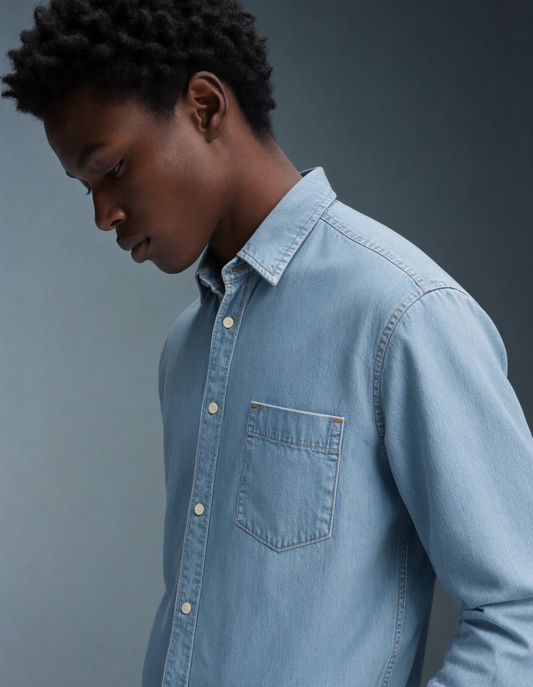

# Qwen-Image-2.1 reference editing

Native MLX inference for [Qwen/Qwen-Image-2.1](https://huggingface.co/Qwen/Qwen-Image-2.1): text-to-image, editing with up to ten reference images, and RGBA output. This is a separate architecture from the earlier [Qwen Image models](../../qwen/README.md), with a 7B diffusion transformer, a Qwen3-VL text/vision encoder, and a 64-channel RGBA VAE.

The `mflux-generate-qwen-2.1-edit` entry point complements the existing `mflux-generate-qwen-2.1` text-to-image and strength-based img2img command. Both use the same model registry entry, Transformer blocks, VAE encoder/decoder, language decoder, component-loading mechanism, and LoRA mappings. This variant adds the vision tower and interleaved reference conditioning. Production implementations live under `qwen21/model`, `weights`, `latent_creator`, and `variants`; `qwen21/reference` retains compatibility imports, these validation notes, and the upstream license. Existing generation behavior and saved checkpoints keep their original entry point.

The shared components preserve each variant's numerical contract. Editing keeps RGBA single-frame VAE output with clipping, its normalization rounding, and pre-final-norm language features with DeepStack injection. Text generation keeps RGB output, its VAE attention arithmetic, padding mask, and final language RMSNorm, without loading a vision tower. Separate model objects retain separate parameters and request state.

The editing pipeline includes prefix KV caching, LoRA loading, quantization, local checkpoint export/reload, metadata replay, and the common generation callbacks. Training is not implemented for this variant.

## Generate an image

```sh
mflux-generate-qwen-2.1-edit \
  --prompt "A red panda reading a book under a cherry tree, watercolor illustration" \
  --seed 42 \
  --quantize 8 \
  --output qwen21.png
```

Defaults are **40 steps**, **guidance 1.0**, **1024×1024** for text-to-image, and **KV caching enabled**. The aliases `qwen-image-2.1`, `qwen-2.1`, and `qwen-image-21` all select this model; `--model` can be omitted for this command.

The original checkpoint downloads about 33.1 GB of weights, even when quantizing at load time. Quantization applies to eligible transformer and text/vision encoder layers; the VAE stays in fp32. Peak memory depends on resolution, reference images, and quantization. Use `--vae-tiling` to reduce decode memory or `--low-ram` for the common memory-saving callbacks.

Explicit width and height must be multiples of 32. The upstream model-card examples use 2048×2048; request that size explicitly:

```sh
mflux-generate-qwen-2.1-edit \
  --prompt "A detailed illustrated botanical poster with the title SPRING" \
  --width 2048 --height 2048 \
  --seed 42 --quantize 8 \
  --vae-tiling \
  --output poster.png
```

## Edit with reference images



The 896×1152 example uses the two inputs and prompt from the [official ComfyUI editing workflow](https://github.com/Comfy-Org/workflow_templates/blob/main/templates/image_qwen_image_2_1_image_edit.json), an 8-bit model, 25 steps, and guidance 1. The person retains the pose and background while wearing the second reference's denim shirt.

```sh
mflux-generate-qwen-2.1-edit \
  --image-paths portrait.png \
  --prompt "Change the jacket to dark green. Preserve the person's face and pose." \
  --seed 42 --quantize 8 \
  --output-resolution 512 \
  --output edited.png
```

```sh
mflux-generate-qwen-2.1-edit \
  --image-paths subject.png scene.png \
  --prompt "Place the subject from image 1 in the setting of image 2." \
  --seed 42 --quantize 8 \
  --output-resolution 512 \
  --output combined.png
```

The editing examples use the 512-pixel reference budget exercised by the local single- and two-reference visual checks. See [validation results](VALIDATION.md) for the larger-size samples and their limitations.

Reference order is significant. If width and height are omitted, the last reference image determines the output aspect ratio. `--output-resolution` defaults to 1024 and sets the pixel-area budget used to resize each reference and derive automatic output dimensions. `--width` and `--height` control output dimensions independently of that reference budget. Reference images must remain within the checkpoint processor's pixel-area range after resizing; the default budget handles ordinary aspect ratios.

RGBA references retain alpha in the VAE. The vision encoder reads a separate copy composited over white, matching the upstream pipeline.

## Local edits, strength and self-checks

These options act on the first reference image. They are MFLUX additions, not part of the upstream pipeline.

| Option | Effect |
| --- | --- |
| `--mask-image mask.png` | Inpaint: white repaints, black keeps the source. Unmasked latents follow the source's own noise trajectory at every step, and a final pixel composite keeps them exact. |
| `--auto-mask "the red shirt"` | Asks the text encoder's Qwen3-VL to locate the object and turns its box into the mask. Ignored with `--mask-image`. |
| `--strength 0.6` | Skips the first `1 - strength` of the schedule and starts from the source noised to that point, for subtler edits. The default `1.0` starts from pure noise. |
| `--enhance-prompt` | Rewrites a terse instruction into a detailed prompt first, following the official prompt-rewrite recipe. An unparseable reply keeps the original. |
| `--verify` / `--verify-retries N` | Asks the Qwen3-VL whether the edit applied and the rest is unchanged, and regenerates with the next seed up to `N` times on a failed check. |
| `--use-step-cache` | Skips transformer blocks 1..N on steps whose first-block output barely changed (threshold `--step-cache-threshold`, default 0.12). Faster, and slightly different output. Needs `--use-kv-cache`. |

```sh
mflux-generate-qwen-2.1-edit \
  --image-paths portrait.png \
  --auto-mask "the jacket" \
  --prompt "Change the jacket to dark green." \
  --seed 42 --quantize 8 \
  --output edited.png
```

Auto-mask, prompt rewriting and verification decode greedily with the text encoder's own untied `lm_head`, so they need no extra download. The head is about 1.2 GB in bf16 and 0.66 GB at q8. The loader keeps it lazy and reads it only when one of these options first uses it. `save_model` still writes the head, so exports keep these options. Checkpoints saved before this support existed do not have the head. They still generate, but these three options raise an error with them.

## ControlNet (Fun ControlNet Union)

`mflux-generate-qwen-2.1-controlnet` runs Qwen-Image-2.1 with the [Fun ControlNet Union](https://huggingface.co/alibaba-pai/Qwen-Image-2.1-Fun-Controlnet-Union) from Alibaba PAI. One 7.6 GB checkpoint reads Canny, depth, grayscale, HED, lineart, MLSD, pose and scribble images, so there is no control-type flag. The same branch inpaints.

```sh
mflux-generate-qwen-2.1-controlnet \
  --prompt "A man in a white t-shirt holds his open hand toward the camera, soft window light, photograph" \
  --controlnet-image-path canny.png \
  --width 640 --height 384 \
  --steps 20 --seed 43 -q 8 \
  --output controlled.png
```

```sh
mflux-generate-qwen-2.1-controlnet \
  --prompt "A young woman with long purple hair stands on a beach with one hand on her hip, white sleeveless dress" \
  --image-path source.png --mask-image mask.png \
  --controlnet-image-path pose.png \
  --width 512 --height 896 \
  --seed 43 -q 8 \
  --output inpainted.png
```

- `--controlnet-strength` scales every control skip: `1.0` (the default) is the strongest, lower values weaken it, and `0` gives the base model.
- `--image-path` with `--mask-image` inpaints: white in the mask is regenerated from the prompt and black is kept. Add `--controlnet-image-path` and the regenerated region follows that structure too. Describe the whole target image in the prompt; the mask says where, the text does not.
- Width and height are multiples of 32, and the control image, the source and the mask are resized to them. When they are omitted the size comes from `--output-resolution` and the aspect ratio of the control image (of the source when there is no control image).
- The control branch adds 16 blocks to the 32 of the base model, and the prefix KV cache is off while it runs. On an M5 Max at q8, 20 steps at 992x608 take about 49 seconds and peak at about 30 GB.
- The ControlNet loads from its own checkpoint each time. `mflux-save` does not write it.

From Python it is `QwenImage21Controlnet` in `mflux.models.qwen21.variants.controlnet.qwen_image_21_controlnet`, with `controlnet_image_path`, `controlnet_strength`, `image_path` and `mask_image` on `generate_image`.

## LoRA

Use the same LoRA arguments and adapter formats as the text-to-image command:

```sh
mflux-generate-qwen-2.1-edit \
  --image-paths portrait.png \
  --prompt "Change the jacket to dark green. Preserve the person's face and pose." \
  --lora adapter.safetensors 1.0 \
  --seed 42 --quantize 8 \
  --output edited-with-lora.png
```

Supported mappings include PEFT `.default`, `transformer.`, and `diffusion_model.` formats, including fused `gate_up` adapters. DoRA and mixed full-weight files remain unsupported. Use `--no-bake-lora` to keep adapters separate during inference; model export uses the common saver, which bakes their effect into the saved weights. Reload an exported adapted model without reapplying the same adapter. Image metadata records the adapter paths and scales used for generation.

The Python constructor accepts `lora_paths=["adapter.safetensors"]`, `lora_scales=[1.0]`, and `bake_lora=True` alongside the existing model arguments. Whether a particular adapter produces useful reference edits depends on its training; sharing the loader does not establish edit quality for every adapter.

## Transparent output

```sh
mflux-generate-qwen-2.1-edit \
  --prompt "This is an RGBA image with transparency. A cute red panda sticker. The image has alpha channel and the background is transparent." \
  --seed 42 --quantize 8 \
  --output sticker.png
```

All outputs have four channels; the prompt determines whether the generated alpha is transparent or opaque. The CLI accepts PNG, WebP, and TIFF to retain alpha. PNG is recommended for lossless output and embedded metadata.

## Quantized checkpoints and reproducibility

Export the complete reference-capable model from Python:

```python
from mflux.models.qwen21.reference import QwenImage21Edit

model = QwenImage21Edit(quantize=8)
model.save_model("./qwen21-8bit")
```

The existing `mflux-save --model qwen-image-2.1` exports the original text-only implementation and omits the vision tower. Those exports cannot be used by this editing entry point. Use the native Hugging Face checkpoint or an export produced by `QwenImage21Edit.save_model`.

Exports created before component consolidation remain loadable through their original entry points. The loader translates the old `modulation.1` and text VAE convolution/norm parameter names to the shared layouts without requantizing tensors. The generation and editing variants retain their respective quantization defaults and export contents.

```sh
mflux-generate-qwen-2.1-edit \
  --model ./qwen21-8bit \
  --prompt "A red panda reading a book" \
  --seed 42 --make-conf \
  --output saved-model.png

mflux-generate-qwen-2.1-edit \
  --model ./qwen21-8bit \
  --config-from-conf saved-model.metadata.json \
  --output replay.png
```

Use `--no-use-kv-cache` to recompute the prefix each step. Keep this setting fixed when comparing samples: cached and uncached execution can produce different images in reduced precision. Metadata records the cache flag and reference resolution budget, and explicit CLI values override restored metadata. MLX and PyTorch use different random-number generators, so matching seeds alone does not imply matching images.

Optional classifier-free guidance uses `--guidance` greater than 1 and `--negative-prompt`. The trained default is 1.0. See the [common CLI documentation](../../common/README.md) for prompt files, seeds, step previews, and other shared flags.

## Python

```python
from mflux.models.qwen21.reference import QwenImage21Edit

model = QwenImage21Edit(quantize=8)
image = model.generate_image(
    seed=42,
    prompt="A red panda reading a book, transparent background",
    width=1024,
    height=1024,
)
image.save("panda.png")

edited = model.generate_image(
    seed=42,
    prompt="Give the panda a blue scarf.",
    image_paths=["panda.png"],
    output_resolution=512,
)
edited.save("panda-scarf.png")
```

## Reference and validation

The port targets checkpoint revision [`b3179ad`](https://huggingface.co/Qwen/Qwen-Image-2.1/tree/b3179ad355be050328e483a9dfdd9e60cd62adfa) and the Diffusers implementation at [`80c7ed2`](https://github.com/huggingface/diffusers/tree/80c7ed262aeffbeb43ef13ae04baeb9b84515a69/src/diffusers/pipelines/qwenimage21). Adapted model code retains its Apache-2.0 attribution; the upstream license is included in [LICENSE.diffusers](LICENSE.diffusers). Checkpoint use is governed by the model's [Qwen Research License](https://huggingface.co/Qwen/Qwen-Image-2.1/blob/b3179ad355be050328e483a9dfdd9e60cd62adfa/LICENSE).

Fast tests cover the registry, metadata, RGBA serialization, latent layout, prefix masks, and cached decoding. Optional reference tests compare transformer, VAE, and scheduler behavior against Diffusers with identical weights and inputs. The small PyTorch reference models run on CPU so the tests do not depend on the CI runner's MPS support; MLX still uses Metal. Diffusers comparisons skip when that reference implementation is unavailable:

```sh
MFLUX_PRESERVE_TEST_OUTPUT=1 uv run \
  --with "diffusers @ git+https://github.com/huggingface/diffusers@80c7ed262aeffbeb43ef13ae04baeb9b84515a69" \
  python -m pytest tests/image_generation/test_qwen_image21_parity.py
```

Real checkpoint tests have produced 1024-pixel text-to-image and transparent PNG outputs, 512-pixel single- and two-reference edits, a successful 896×1152 two-reference clothing edit using the official ComfyUI workflow inputs, and pixel-identical output after 8-bit checkpoint export/reload. A 2048×2048 text-generation case passed a full 40-step visual check with 8-bit weights and tiled VAE decoding on 2026-09-30. The original 1024×1024 panda edits missed the requested changes in both MLX and the controlled Diffusers reference run; expanding the prompts did not resolve those samples. The existing text-only golden also remains failing locally, including with its introducing code; that investigation and the bounded 2048 result are recorded in [VALIDATION.md](VALIDATION.md).
